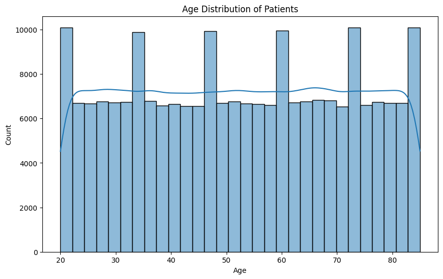
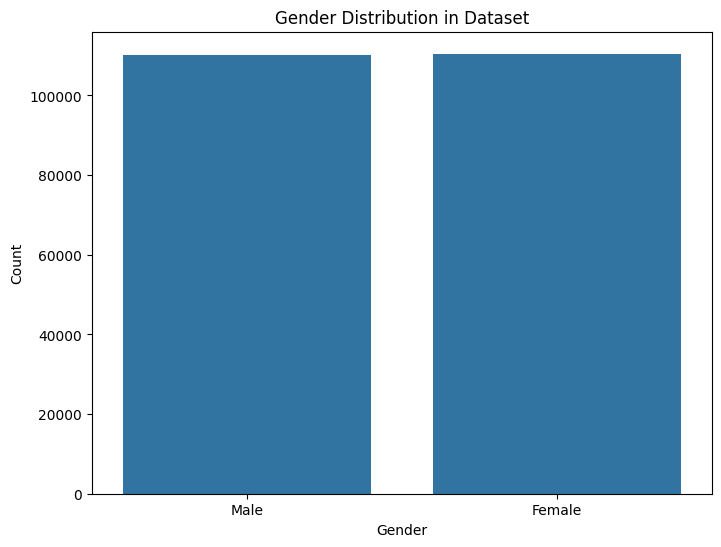
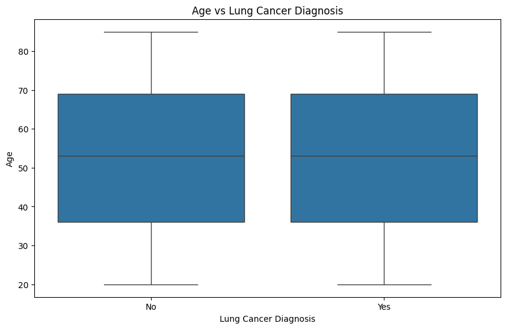
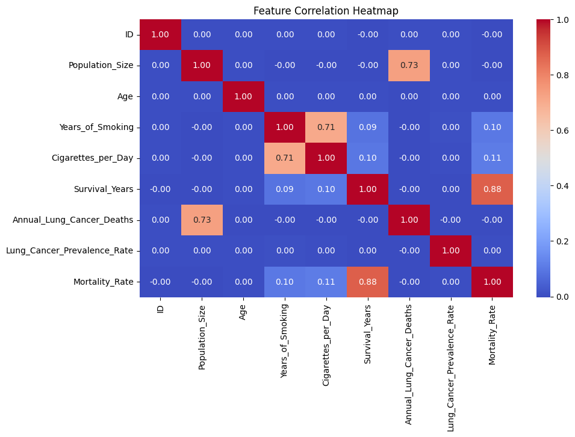
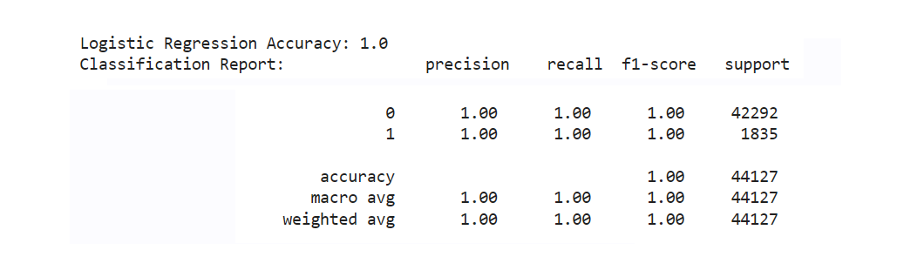
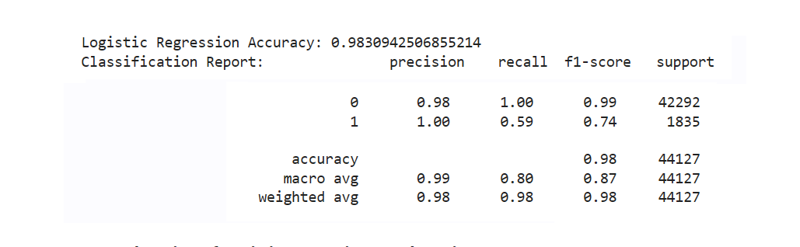

# Lung Cancer Early Detection: 
## Helping people forcast the likelihood of developing lung cancer

### Table of Contents

1. [Contributors](#contributors)
2. [Executive Summary](#executive-summary)
3. [Key Points to Consider](#key-points-to-consider)
4. [Project Objectives](#project-objectives)
5. [Approach and Methodology](#approach-and-methodology)
6. [Models](#models)
7. [Tools and Techniques](#tools-and-techniques)
8. [How To Run](#how-to-run)
9. [License](#license)
10. [Next Steps](#next-steps)

### Contributors

Contributors to the project (pictured from left to right):
* **Saurabh Pratap Singh**
* **Valarie Miller**
* **Eshumael Manhanzva**
* **Cameron Keplinger**
* **Luther Johnson**
* **Sowmya Shetty**
* **Sunil Khambaita (Advisor)**

### Executive Summary 

To help people identify their likelihood of developing lung cancer based on a variety of factors including age, environment and health. This project analyzes a lung cancer dataset using classification, regression, and clustering.

In this project we succefully completed the following:

* Predict lung cancer diagnosis using **classification**
* Predict lung cancer diagnosis using **logistic regression, Decision Tree , RandomForestClassifer**
* Identify clusters of patients based on risk factors using **K-Means clustering**

### Key Points to Consider

* **Age**
* **Environment**
* **Access to Good Healthcare**
* **Smoking Habits**

### Project Objectives

#### Data Collection & Cleaning

This dataset offers important insights into lung cancer cases, risk factors, smoking trends, and healthcare access in 25 of the world’s most populated countries. It includes information on 220,632 individuals, detailing their age, gender, smoking history, cancer diagnosis, environmental exposure, and survival rates. This dataset is instrumental for medical research, predictive modeling, and policy-making to understand global lung cancer patterns.

#### Data source: https://www.kaggle.com/datasets/ankushpanday1/lung-cancer-risk-and-trends-across-25-countries

* 25 of the World’s Most Populated Countries
* 24 Data Columns
* 220632 Total Records
* Equal Distribution of Men and Women
* Ages Range From 22 to 85 Years Old

### Approach and Methodology

Our approach utilizes the following: 
Clustering: Cluster countries based on lung cancer risk factors using:
* Population, annual lung cancer deaths, lung cancer prevalence, mortality rate, air pollution, exposure, occupational exposure, indoor pollution, access to good healthcare
* Clustering: Cluster according to risk level, of low, medium, high. For example, 
	* Low: young, non-smoker, good healthcare access
	* Medium: (family history, poor environment) 
	* High: older, smoker, poor health care 

#### Exploratory Data Analysis

The dataset covers a wide age range (20-85 years) with Uniform Age Spread with Periodic Spikes. The spikes at regular intervals suggest possible grouped data collection.
No significant skewness, implying age alone may not be the primary risk factor.

#### Gender Distribution
The dataset contains an almost equal number of male and female patients.
This balanced gender distribution ensures that gender-related insights are unbiased.

#### Age vs Lung Cancer
The age distribution is similar for both diagnosed and non-diagnosed patients.
The median age for both groups is around 50-55 years.
No significant outliers, suggesting lung cancer affects a broad age range.

#### Feature Correlation
The correlation heatmap helps identify relationships between numerical features, offering insights into potential predictors for lung cancer.

Strong Positive Correlations:

* Years of Smoking vs. Cigarettes per Day (0.71):
	* Indicates that longer smoking duration tends to result in a higher number of cigarettes consumed daily.
* This suggests that both factors should be considered together when assessing smoking-related lung cancer risk.
* Population Size vs. Annual Lung Cancer Deaths (0.73):
	* Larger populations tend to report higher absolute lung cancer deaths. However, this may not reflect an 	increased prevalence rate, just a larger affected population.
* Survival Years vs. Mortality Rate (0.88):
	*Higher mortality rates correlate with shorter survival times, which is expected. This supports the 		importance of early detection and better treatment access. Moderate or Weak Correlations:
* Years of Smoking vs. Survival Years (0.09):
	* Surprisingly weak correlation suggests that other factors, such as treatment type and genetic 			predisposition, play a significant role in survival.
* Cigarettes per Day vs. Mortality Rate (0.11):
	* Weak correlation, indicating that mortality is influenced by multiple factors, not just smoking.
* Key Takeaways for Predictive Modeling:
	* Strong predictors for mortality and survival include mortality rate, smoking habits, and population size.
 

###  Models

#### Logistic Regression Model - for Classification
First Run - Accuracy Score of the Logistic Regression Model is 100% when we dropped only the 2 columns "Survival_Years","Lung_Cancer_Diagnosis". We removed Survival Years to reduce redundancy between Mortality_Rate

Second Run - Accuracy Score of the Logistic Regression Model is 98% when we dropped the highly co-related columns "Survival_Years","Lung_Cancer_Diagnosis","Mortality_Rate","Adenocarcinoma_Type","Cancer_Stage"

#### Random Forest Classifier Model 
* Acheived 100% accuraccy with the model
* Identified Top 10 Most Important Features

#### Decision Tree Model
* Acheived 100% accuraccy with the model but tree was initially too short
* Removed the some data sests from dataset to improve the decision tree 
* Acheived 97.4% accuraccy with the model after revisions

#### K-Means with Elbow Method - for Clustering

*Both Supervised & Unsupervised Learning Methodology

### Tools and Techniques

* Pandas & Pandas Plotting
* Python
* Scikit-learn
* Matplotlib
* Numpy

### Next Steps

