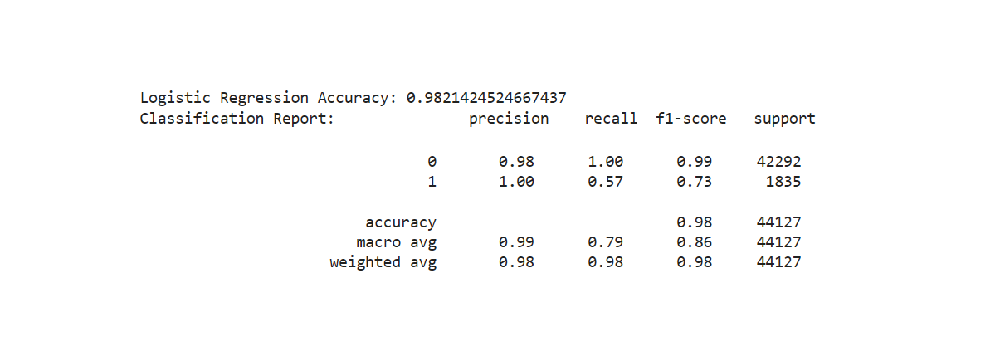

# Lung Cancer Early Detection: 
## Helping people forcast the likelihood of developing lung cancer

### Table of Contents

1. [Contributors](#contributors)
2. [Executive Summary](#executive-summary)
3. [Key Points to Consider](#key-points-to-consider)
4. [Project Objectives](#project-objectives)
5. [Approach and Methodology](#approach-and-methodology)
6. [Models](#models)
7. [Tools and Techniques](#tools-and-techniques)
8. [Snapshot of Outcomes](#snapshot-of-outcomes)
9. [Next Steps](#next-steps)

### Contributors

Contributors to the project (pictured from left to right):
* **Saurabh Pratap Singh**
* **Valarie Miller**
* **Eshumael Manhanzva**
* **Cameron Keplinger**
* **Luther Johnson**
* **Sowmya Shetty**
* **Sunil Khambaita (Advisor)**

### Executive Summary 

To help people identify their likelihood of developing lung cancer based on a variety of factors including age, environment and health. This project analyzes a lung cancer dataset using classification, regression, and clustering.

In this project we succefully completed the following:

* Predict lung cancer diagnosis using **classification**
* Predict lung cancer diagnosis using **logistic regression, Decision Tree , RandomForestClassifer**
* Identify clusters of patients based on risk factors using **K-Means clustering**

### Key Points to Consider

* **Age**
* **Environment**
* **Access to Good Healthcare**
* **Smoking Habits**

### Project Objectives

#### Data Collection & Cleaning

This dataset offers important insights into lung cancer cases, risk factors, smoking trends, and healthcare access in 25 of the world’s most populated countries. It includes information on 220,632 individuals, detailing their age, gender, smoking history, cancer diagnosis, environmental exposure, and survival rates. This dataset is instrumental for medical research, predictive modeling, and policy-making to understand global lung cancer patterns.

#### Data source: https://www.kaggle.com/datasets/ankushpanday1/lung-cancer-risk-and-trends-across-25-countries

* 25 of the World’s Most Populated Countries
* 24 Data Columns
* 220632 Total Records
* Equal Distribution of Men and Women
* Ages Range From 22 to 85 Years Old

### Approach and Methodology

Our approach utilizes the following: 
Clustering: Cluster countries based on lung cancer risk factors using:
* Population, annual lung cancer deaths, lung cancer prevalence, mortality rate, air pollution, exposure, occupational exposure, indoor pollution, access to good healthcare
* Clustering: Cluster according to risk level, of low, medium, high. For example, 
	* Low: young, non-smoker, good healthcare access
	* Medium: (family history, poor environment) 
	* High: older, smoker, poor health care 

#### Exploratory Data Analysis

The dataset covers a wide age range (20-85 years) with Uniform Age Spread with Periodic Spikes. The spikes at regular intervals suggest possible grouped data collection.
No significant skewness, implying age alone may not be the primary risk factor.

#### Gender Distribution
The dataset contains an almost equal number of male and female patients.
This balanced gender distribution ensures that gender-related insights are unbiased.

#### Age vs Lung Cancer
The age distribution is similar for both diagnosed and non-diagnosed patients.
The median age for both groups is around 50-55 years.
No significant outliers, suggesting lung cancer affects a broad age range.

#### Feature Correlation
The correlation heatmap helps identify relationships between numerical features, offering insights into potential predictors for lung cancer.

**Strong Positive Correlations:**

* Years of Smoking vs. Cigarettes per Day (0.71):
	* Indicates that longer smoking duration tends to result in a higher number of cigarettes consumed daily.
	* This suggests that both factors should be considered together when assessing smoking-related lung cancer risk.
* Population Size vs. Annual Lung Cancer Deaths (0.73):
	* Larger populations tend to report higher absolute lung cancer deaths. However, this may not reflect an increased prevalence rate, just a larger affected population.
* Survival Years vs. Mortality Rate (0.88):
	* Higher mortality rates correlate with shorter survival times, which is expected. This supports the importance of early detection and better treatment access. Moderate or Weak Correlations:
* Years of Smoking vs. Survival Years (0.09):
	* Surprisingly weak correlation suggests that other factors, such as treatment type and genetic predisposition, play a significant role in survival.
* Cigarettes per Day vs. Mortality Rate (0.11):
	* Weak correlation, indicating that mortality is influenced by multiple factors, not just smoking.
* Key Takeaways for Predictive Modeling:
	* Strong predictors for mortality and survival include mortality rate, smoking habits, and population size.
 

###  Models

#### Logistic Regression Model - for Classification
**First Run** - Accuracy Score of the Logistic Regression Model is 100% when we dropped only the 2 columns "Survival_Years","Lung_Cancer_Diagnosis". We removed Survival Years to reduce redundancy between Mortality_Rate

The Logistic Regression model has achieved 100% accuracy on the test dataset in the first run when we dropped only 2 columns "Survival_Years" and "Lung_Cancer_Diagnosis". Let's break down the key evaluation metrics:
* Accuracy = 1.00 (100%) This means that all predictions made by the model were correct.Since the model achieved 1.00, there were no misclassifications.
* Precision, Recall, and F1-Score = 1.00 These scores are 1.00 for both classes (0 = No Lung Cancer, 1 = Lung Cancer), meaning:
* Precision (1.00): Every patient predicted to have lung cancer actually had lung cancer. No false positives (incorrect lung cancer diagnoses).
* Recall (1.00): The model successfully identified all lung cancer cases in the dataset. No false negatives (missed lung cancer cases).
* F1-Score (1.00): Since both precision and recall are perfect, the F1-score, which is their harmonic mean, is also perfect.
*-3. Class Distribution & Support Class 0 (No Lung Cancer): 42,292 patients Class 1 (Lung Cancer): 1,835 patients Despite the class imbalance, the model correctly classified all cases.

**Second Run** - Accuracy Score of the Logistic Regression Model is 98% when we dropped the highly co-related columns "Survival_Years","Lung_Cancer_Diagnosis","Mortality_Rate","Adenocarcinoma_Type","Cancer_Stage"

The Logistic Regression model has achieved 98% accuracy on the test dataset in the second run when we dropped highly co-related columns "Survival_Years","Lung_Cancer_Diagnosis","Mortality_Rate","Adenocarcinoma_Type","Cancer_Stage"
* Overall Accuracy is High (98%) The model correctly classifies 98% of all cases. This indicates strong general performance but needs further verification for minority class predictions.
* Perfect Precision for Lung Cancer Cases (Class 1) (1.00)
* Every predicted positive (Lung Cancer) case is actually a true positive. There are zero false positives, meaning no incorrect lung cancer diagnoses.
* Recall for Lung Cancer Cases is 57% The model fails to detect 43% of actual lung cancer cases. This means it is still missing a significant number of positive cases.
* Class 0 (No Lung Cancer) is Predicted Almost Perfectly Precision = 0.98 and Recall = 1.00, meaning nearly all non-cancer cases are correctly classified.
* Macro F1 Score is 0.86, Weighted F1 Score is 0.98 The weighted F1 score is higher due to the dominance of Class 0. Macro F1 score is lower, indicating that the model performs better on Class 0 than Class 1.

**Third Run** - Introduced max_iter = 1000 This is the maximum number of iterations for the optimization algorithm . Increasing this can help if the model does not converge with fewer iterations.

**Fourth Run** - Introduced penalty

#### Data Model Optimization - Cross Validation
A corrective measure for overfitting is data Cross Validation. Cross validation by splitting training data set into 5 folds

* The accuracy for each fold of training dataset is approximately the same and not much deviation from the training accuracy.
* Test accuracy (X_test) is calculated separately . This ensures a fair evaluation of the final model on unseen data.
* Used stratify=y Prevents class imbalance in train/test sets

Since we ave an imbalanced dataset (e.g., 96% class 0, 4% class 1), a random split without stratification might result in a test set with too few samples of the minority class. stratify=y ensures both train and test sets have the same class distribution as the original dataset.

#### Random Forest Classifier Model 
Accuracy Score of the Random Forest Classifier Model is 100% when we dropped only the 2 columns "Survival_Years","Lung_Cancer_Diagnosis"

Accuracy Score of the Random Forest Classifier Model is 98% when we dropped only the highly co-related columns "Survival_Years","Lung_Cancer_Diagnosis","Mortality_Rate","Adenocarcinoma_Type","Cancer_Stage"

#### Top 10 Most Important Characteristics 

#### Decision Tree Model
The Initial Decision Tree Model Accuracy Score : 1.0
* Exploring Decision Tree Model by removing "Adenocarcinoma_Type" , "Cancer_Stage" ,"Survival_Years" from the training dataset. 

* The accuracy score of the improved Decision Tree Model = 0.9744147574047636

#### K-Means with Elbow Method - for Clustering
Finding the Optimal Number of Clusters (K) The "elbow" point is where the rate of inertia reduction slows down significantly.
* Looking at the plot, the elbow appears at k = 3 or k = 4, meaning:
	* Before this point, adding clusters significantly reduces inertia.
	* After this point, adding more clusters has diminishing returns (minor improvements in cluster quality but increased complexity
  

Explanation of K-Means Clustering Visualization:
This scatter plot represents K-Means Clustering based on Years of Smoking (X-axis) and Cigarettes per Day (Y-axis). The different colors represent different clusters.

** What the Clusters Represent**
* Cluster 0 (Dark Purple): Light smokers or new smokers (few years of smoking, fewer cigarettes per day). Includes individuals with low smoking exposure.
* Cluster 1 (Teal/Blue-Green): Moderate smokers (mid-range years of smoking, medium cigarette consumption). Likely individuals with some smoking-related risks but not extreme.
* Cluster 2 (Yellow): Heavy smokers (long history of smoking, high daily cigarette consumption). Likely high-risk individuals for lung cancer and smoking-related diseases.
  

Most data points fall into Cluster 2 (yellow), indicating a large group of heavy smokers. Cluster 0 (dark purple) is concentrated in the lower-left region, representing beginners or occasional smokers. Cluster 1 (teal) lies in between, showing a transition from light to heavy smoking. The clustering pattern aligns well with known smoking risk categories.
Interpretation & Impact Health Risk Segmentation:
* Cluster 2 (heavy smokers) is at high risk and should be the primary target for preventive measures and medical interventions.
* Cluster 1 (moderate smokers) may still have a chance to reduce their risk with interventions.
* Cluster 0 (light smokers) represents early-stage smokers who could benefit from quitting programs.
  
**Policy & Medical Recommendations:**
Public health campaigns should focus more on heavy smokers (Cluster 2). Lung cancer screening programs can prioritize individuals in Clusters 1 & 2.

### Tools and Techniques

* Pandas & Pandas Plotting
* Python
* Scikit-learn
* Matplotlib
* Numpy

### Snapshot of Outcomes

### Next Steps

